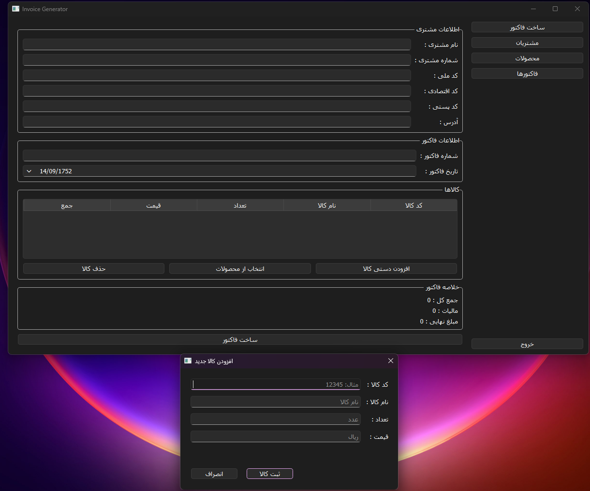

## تصاویر نرم‌افزار


---

# Invoice Generator – Professional Invoice Management System


---

## 📌 Table of Contents (English)
1. [Introduction](#introduction)
2. [Features](#features)
3. [Technologies Used](#technologies-used)
4. [Installation & Setup](#installation--setup)
   - [Prerequisites](#prerequisites)
   - [Step-by-Step Installation](#step-by-step-installation)
   - [Installing wkhtmltopdf (Critical)](#installing-wkhtmltopdf-critical)
5. [How to Run](#how-to-run)
6. [Project Structure](#project-structure)
7. [Usage Guide](#usage-guide)
   - [Creating an Invoice](#creating-an-invoice)
   - [Managing Customers](#managing-customers)
   - [Managing Products](#managing-products)
   - [Viewing Invoices](#viewing-invoices)
8. [Database Schema](#database-schema)
9. [Customization & Configuration](#customization--configuration)
10. [Troubleshooting](#troubleshooting)
11. [Contributing](#contributing)
12. [License](#license)
13. [Contact](#contact)

---

## Introduction

**Invoice Generator** is a full‑featured desktop application built with Python and PySide6 that allows businesses to create, manage, and print professional invoices. It provides an intuitive graphical interface to handle customers, products, and invoices, and generates high‑quality PDF documents ready for printing or emailing.

The application is completely offline, stores all data in a local SQLite database, and respects user privacy. It is ideal for small to medium‑sized businesses, freelancers, and shop owners who need a reliable, free, and open‑source invoicing solution.

---

## Features

| Module | Capabilities |
|--------|--------------|
| **Invoice Creation** | – Add/remove items dynamically<br>– Auto‑calculate totals, tax (configurable rate)<br>– Select products from database or add manually<br>– Choose invoice date (defaults to today)<br>– Validate duplicate invoice numbers<br>– Generate HTML and PDF output with company branding |
| **Customer Management** | – Add, edit, delete customers<br>– Search by name or phone<br>– View all invoices of a specific customer |
| **Product Management** | – Add, edit, delete products<br>– Search by code or name<br>– Store price and description |
| **Invoice Archive** | – List all invoices with search by number or customer name<br>– Reprint any invoice as PDF without modifying original |
| **User Interface** | – Fully right‑to‑left (RTL) Persian support<br> – Tabs for different modules<br>– Responsive layout with status bar |
| **Output** | – HTML preview (saved in `output/html/`)<br>– PDF generation via wkhtmltopdf (saved in `output/pdf/`)<br>– Unique filenames (invoice number + timestamp) prevent overwriting |

---

## Technologies Used

- **Python 3.9+** – Core language
- **PySide6** – Qt for Python (GUI framework)
- **SQLite3** – Embedded database (no server required)
- **Jinja2** – HTML template engine
- **pdfkit** – Python wrapper for wkhtmltopdf
- **wkhtmltopdf** – Command line tool to convert HTML to PDF
- **jdatetime** – Persian (Jalali) date handling

---

## Installation & Setup

### Prerequisites

- **Python 3.9 or higher** installed on your system.
- **pip** (Python package manager).
- **wkhtmltopdf** – **mandatory** for PDF generation (see dedicated section below).
- Internet connection for downloading Python packages (first time only).

### Step‑by‑Step Installation

1. **Clone the repository** (or download the source code):
   ```bash
   git clone https://github.com/yourusername/invoice-generator.git
   cd invoice-generator
   ```

2. **Create a virtual environment** (recommended):
   ```bash
   python -m venv venv
   source venv/bin/activate      # Linux / macOS
   venv\Scripts\activate          # Windows
   ```

3. **Install required Python packages**:
   ```bash
   pip install -r requirements.txt
   ```
   Contents of `requirements.txt`:
   ```
   PySide6>=6.5.0
   jinja2>=3.1.0
   pdfkit>=1.0.0
   jdatetime>=4.1.0
   ```

4. **Install wkhtmltopdf** (see next section).

5. **Initialize the database**:
   The database file (`invoice.db`) will be created automatically when you run the application for the first time. Alternatively, you can run:
   ```bash
   python -m database.db
   ```
   This will create all necessary tables.

### Installing wkhtmltopdf (Critical)

**Why is it needed?**  
The application uses `pdfkit` which is only a wrapper. The actual conversion from HTML to PDF is done by **wkhtmltopdf**. Without it, PDF generation will fail.

**Installation steps:**

- **Windows**:
  1. Download the installer from [wkhtmltopdf official site](https://wkhtmltopdf.org/downloads.html) (choose the stable version for Windows).
  2. Run the installer. **Remember the installation path** (typically `C:\Program Files\wkhtmltopdf\bin\wkhtmltopdf.exe`).
  3. The application will try to auto‑detect the path. If detection fails, you can manually set the path in `config/settings.py` (see Customization section).

- **Linux (Debian/Ubuntu)**:
  ```bash
  sudo apt-get update
  sudo apt-get install wkhtmltopdf
  ```

- **macOS** (using Homebrew):
  ```bash
  brew install wkhtmltopdf
  ```

After installation, verify it works by opening a terminal and typing:
```bash
wkhtmltopdf --version
```

---

## How to Run

Make sure you are in the project root directory and your virtual environment is activated.

```bash
python -m gui.app
```

Or, if you prefer:
```bash
python gui/app.py
```

The main window will appear. From there you can navigate to different sections via the left sidebar.

---

## Project Structure

```
invoice-generator/
│
├── gui/                       # Graphical User Interface package
│   ├── app.py                 # Application entry point
│   ├── main_window.py         # Main window with stacked pages
│   ├── dialogs/               # Custom dialogs
│   │   ├── add_product_dialog.py
│   │   └── select_product_dialog.py
│   ├── pages/                 # Each page (tab)
│   │   ├── create_invoice_page.py
│   │   ├── customers_page.py
│   │   ├── products_page.py
│   │   └── invoices_page.py
│   └── utils/                 # Helper modules (optional)
│       └── message_box.py
│
├── services/                  # Business logic
│   └── invoice_service.py     # Invoice creation, PDF generation, reprint
│
├── core/                      # Core calculation modules
│   ├── calculator.py          # Total, tax, final
│   ├── customer_input.py      # (Legacy CLI – kept for reference)
│   └── invoice_generator.py   # HTML rendering using Jinja2
│
├── database/                  # Database operations
│   ├── db.py                  # Connection and table creation
│   ├── customer_repo.py       # CRUD for customers
│   ├── product_repo.py        # CRUD for products
│   └── invoice_repo.py        # CRUD for invoices and items
│
├── config/                    # Configuration
│   └── settings.py            # Paths, tax rate, company info
│
├── templates/                 # HTML template for invoices
│   └── factor_1.html
│
├── output/                    # Generated files (ignored by git)
│   ├── html/
│   └── pdf/
│
├── requirements.txt
├── .gitignore
├── LICENSE
└── README.md                  # This file
```

---

## Usage Guide

### Creating an Invoice

1. Click **"ساخت فاکتور"** (Create Invoice) in the sidebar.
2. Fill in customer details (Name, Phone, National ID, etc.).
3. Enter an **Invoice Number** (must be unique; duplicate detection is active).
4. Choose the invoice date (default is today, Persian calendar).
5. Add products:
   - Click **"افزودن دستی کالا"** (Manual Add) to enter product code, name, quantity, price directly.
   - Or click **"انتخاب از محصولات"** (Select from Products) to pick an existing product from the database. You will be prompted for quantity.
6. The table will show each product with its total (quantity × price).
7. You can **double‑click** on the Quantity or Price cells to edit them directly. Totals and invoice summary update automatically.
8. To remove a product, select its row and click **"حذف کالا"** (Remove Product).
9. Check the **invoice summary** (Total, Tax, Final) – tax rate is read from settings (default 9%).
10. Click **"ساخت فاکتور"** (Create Invoice).
11. If validation passes, the system will:
    - Save the invoice in the database.
    - Generate an HTML file (unique name).
    - Convert it to PDF (unique name).
    - Show a success message with the PDF path.
12. The invoice is now stored and can be reprinted later.

### Managing Customers

- Navigate to **"مشتریان"** (Customers).
- Use the search bar to filter by name or phone.
- **Add new customer**: fill the dialog (name and phone are mandatory).
- **Edit**: select a customer, click "ویرایش", modify data.
- **Delete**: select and confirm deletion (invoices of that customer remain untouched).
- **View invoices**: click the "فاکتورها" button in the last column to see all invoices belonging to that customer in a separate window.

### Managing Products

- Navigate to **"محصولات"** (Products).
- Similar operations: add, edit, delete, search by code/name.
- Product information includes code, name, price, and optional description.

### Viewing Invoices

- Go to **"فاکتورها"** (Invoices).
- A table shows all invoices with invoice number, date, customer name, and final amount.
- You can search by invoice number or customer name.
- Click the **"چاپ PDF"** button in each row to re‑generate the PDF from the stored data. This will create a new PDF file (with a timestamp) without overwriting the original.

---

## Database Schema

The SQLite database (`invoice.db`) contains the following tables:

```sql
-- Customers
CREATE TABLE customers (
    id INTEGER PRIMARY KEY AUTOINCREMENT,
    name TEXT NOT NULL,
    phone TEXT,
    national_code TEXT,
    economic_code TEXT,
    postal_code TEXT,
    address TEXT
);

-- Products
CREATE TABLE products (
    id INTEGER PRIMARY KEY AUTOINCREMENT,
    code TEXT UNIQUE,
    name TEXT NOT NULL,
    price INTEGER NOT NULL,
    description TEXT
);

-- Invoices
CREATE TABLE invoices (
    id INTEGER PRIMARY KEY AUTOINCREMENT,
    invoice_number TEXT UNIQUE NOT NULL,
    invoice_date TEXT,
    customer_id INTEGER,
    total_price INTEGER,
    tax INTEGER,
    final_price INTEGER,
    FOREIGN KEY (customer_id) REFERENCES customers(id)
);

-- Invoice Items (line items)
CREATE TABLE invoice_items (
    id INTEGER PRIMARY KEY AUTOINCREMENT,
    invoice_id INTEGER,
    product_code TEXT,
    product_name TEXT,
    qty INTEGER,
    price INTEGER,
    total INTEGER,
    FOREIGN KEY (invoice_id) REFERENCES invoices(id)
);
```

> **Note:** All monetary values are stored as integers (Rials or Tomans – your choice). The application formats them with thousand separators when displayed.

---

## Customization & Configuration

All settings are located in `config/settings.py`. You can modify:

- **Tax rate** – `TAX_RATE` (e.g., `0.09` for 9%).
- **Company information** – `COMPANY_NAME`, `COMPANY_PHONE`, `COMPANY_ADDRESS` (appears on invoices).
- **Directories** – `TEMPLATE_DIR`, `OUTPUT_HTML_DIR`, `OUTPUT_PDF_DIR`.
- **wkhtmltopdf path** – The function `get_wkhtmltopdf_path()` auto‑detects common locations. If your installation is in a non‑standard place, update the list or hardcode the path.

**Example of customizing tax rate:**
```python
# config/settings.py
TAX_RATE = 0.10   # 10%
```

**Changing company logo / template:**  
Edit the file `templates/factor_1.html`. It uses Jinja2 variables like `{{ company_name }}`, `{{ customer_name }}`, `{{ items }}`, etc. You can fully redesign the invoice layout.

---

## Troubleshooting

| Problem | Possible Solution |
|---------|-------------------|
| **PDF not generated / wkhtmltopdf not found** | – Verify wkhtmltopdf is installed and its path is included in system PATH. <br> – In `config/settings.py`, manually set `WKHTMLTOPDF_PATH = r"C:\full\path\to\wkhtmltopdf.exe"`. |
| **Duplicate invoice number error** | The system prevents duplicate invoice numbers. Use a different number. |
| **Application does not start / ImportError** | Make sure your virtual environment is active and all requirements are installed: `pip install -r requirements.txt`. |
| **GUI appears with left‑to‑right alignment** | The application uses `app.setLayoutDirection(Qt.RightToLeft)`. If you prefer LTR, remove that line in `gui/app.py`. |
| **Persian characters not shown correctly** | Install a Persian font (e.g., Vazirmatn) and set it in `gui/app.py` using `QFont("Vazirmatn", 10)`. |
| **SQLite database locked** | Close any other program that might be using the database (e.g., DB Browser). The application uses a single connection per operation and closes it immediately. |
| **PDF output is empty or missing styles** | Check that the HTML template `factor_1.html` exists in `templates/` and that all CSS is inline or linked correctly (wkhtmltopdf supports external CSS but paths must be absolute or relative to the HTML file). |

---

## Contributing

Contributions are welcome! To keep the project consistent:

1. **Fork** the repository.
2. **Create a feature branch** (`git checkout -b feature/amazing-feature`).
3. **Commit your changes** (`git commit -m 'feat: add some amazing feature'`).
4. **Push** to the branch (`git push origin feature/amazing-feature`).
5. **Open a Pull Request**.

Please follow the existing code style (PEP 8), add docstrings for new functions, and update the README if necessary.

**Areas where help is especially appreciated:**
- Adding a **dark mode**.
- Implementing **email sending** of PDF invoices.
- Creating an **installer** (Inno Setup for Windows, .dmg for macOS).
- Writing **unit tests**.

---

## License

Distributed under the MIT License. See `LICENSE` file for more information.

**You are free to:**  
- Use, copy, modify, merge, publish, distribute, sublicense, and/or sell copies of the Software.  
- Use the software in commercial applications.

**Only requirement:**  
The original copyright notice and permission notice shall be included in all copies or substantial portions of the Software.

---

## Contact

**Developer:** [Mani Ajorloo]  
**Email:** maniajorloo23333@gmail.com  
**GitHub:** [https://github.com/Mani-IR](https://github.com/Mani-IR)

If you encounter any bugs or have suggestions, please open an issue on the GitHub repository.

<br><br>

# سامانه فاکتورسازی – سیستم حرفه‌ای مدیریت فاکتور
<br>


## 📌 فهرست مطالب 
1. [معرفی](#معرفی)
2. [قابلیت‌ها](#قابلیت‌ها)
3. [فناوری‌های استفاده شده](#فناوری‌های-استفاده-شده)
4. [نصب و راه‌اندازی](#نصب-و-راه‌اندازی)
   - [پیش‌نیازها](#پیش‌نیازها)
   - [نصب گام به گام](#نصب-گام-به-گام)
   - [نصب wkhtmltopdf (بسیار مهم)](#نصب-wkhtmltopdf-بسیار-مهم)
5. [اجرای برنامه](#اجرای-برنامه)
6. [ساختار پروژه](#ساختار-پروژه)
7. [راهنمای استفاده](#راهنمای-استفاده)
   - [ساخت فاکتور جدید](#ساخت-فاکتور-جدید)
   - [مدیریت مشتریان](#مدیریت-مشتریان)
   - [مدیریت محصولات](#مدیریت-محصولات)
   - [مشاهده فاکتورها](#مشاهده-فاکتورها)
8. [طراحی دیتابیس](#طراحی-دیتابیس)
9. [سفارشی‌سازی و تنظیمات](#سفارشی‌سازی-و-تنظیمات)
10. [عیب‌یابی](#عیب‌یابی)
11. [مشارکت در توسعه](#مشارکت-در-توسعه)
12. [مجوز](#مجوز)
13. [تماس](#تماس)


## معرفی

**سامانه فاکتورسازی** یک نرم‌افزار دسکتاپ کامل است که با پایتون و PySide6 نوشته شده و به کسب‌وکارها امکان می‌دهد فاکتورهای حرفه‌ای ایجاد، مدیریت و چاپ کنند. این نرم‌افزار دارای رابط کاربری گرافیکی ساده برای مدیریت مشتریان، محصولات و فاکتورها است و خروجی PDF با کیفیت بالا تولید می‌کند که آماده چاپ یا ارسال ایمیل می‌باشد.

این برنامه به طور کامل آفلاین کار می‌کند، تمام داده‌ها را در یک دیتابیس محلی SQLite ذخیره می‌نماید و به حریم خصوصی کاربر احترام می‌گذارد. برای کسب‌وکارهای کوچک و متوسط، فریلنسرها و صاحبان فروشگاه‌ها که به یک راه‌حل رایگان، متن‌باز و قابل اعتماد برای صدور فاکتور نیاز دارند، ایده‌آل است.

<br>

## قابلیت‌ها

| بخش | امکانات |
|------|---------|
| **ایجاد فاکتور** | – افزودن/حذف پویای کالاها<br>– محاسبه خودکار جمع کل، مالیات (با نرخ قابل تنظیم)<br>– انتخاب کالا از بانک اطلاعاتی یا افزودن دستی<br>– انتخاب تاریخ فاکتور (پیش‌فرض امروز)<br>– اعتبارسنجی شماره فاکتور تکراری<br>– تولید خروجی HTML و PDF با برند شرکت |
| **مدیریت مشتریان** | – افزودن، ویرایش، حذف مشتری<br>– جستجو بر اساس نام یا تلفن<br>– مشاهده همه فاکتورهای یک مشتری خاص |
| **مدیریت محصولات** | – افزودن، ویرایش، حذف محصول<br>– جستجو بر اساس کد یا نام<br>– ذخیره قیمت و توضیحات |
| **آرشیو فاکتورها** | – نمایش همه فاکتورها با قابلیت جستجو بر اساس شماره فاکتور یا نام مشتری<br>– چاپ مجدد هر فاکتور به صورت PDF بدون تغییر فایل اصلی |
| **رابط کاربری** | – پشتیبانی کامل از راست‌چین (فارسی)<br>– تب‌بندی برای بخش‌های مختلف<br>– چیدمان واکنش‌گرا با نوار وضعیت |
| **خروجی** | – ذخیره HTML (در پوشه `output/html/`)<br>– تولید PDF با استفاده از wkhtmltopdf (در پوشه `output/pdf/`)<br>– نام فایل‌های یکتا (شماره فاکتور + زمان‌مهر) برای جلوگیری از بازنویسی |

<br>

## فناوری‌های استفاده شده

- **Python 3.9+** – زبان اصلی
- **PySide6** – Qt برای پایتون (چارچوب GUI)
- **SQLite3** – دیتابیس توکار (بدون نیاز به سرور)
- **Jinja2** – موتور قالب HTML
- **pdfkit** – پکیج پایتون برای wkhtmltopdf
- **wkhtmltopdf** – ابزار خط فرمان برای تبدیل HTML به PDF
- **jdatetime** – کار با تاریخ شمسی (جلالی)

<br>

## نصب و راه‌اندازی

### پیش‌نیازها

- **Python نسخه 3.9 یا بالاتر** نصب شده باشد.
- **pip** (مدیر بسته پایتون).
- **wkhtmltopdf** – **اجباری** برای تولید PDF (بخش اختصاصی زیر را ببینید).
- اتصال به اینترنت برای دانلود پکیج‌های پایتون (فقط بار اول).

### نصب گام به گام

1. **کلون کردن مخزن** (یا دانلود کد منبع):
   ```bash
   git clone https://github.com/yourusername/invoice-generator.git
   cd invoice-generator
   ```

2. **ساخت محیط مجازی** (توصیه می‌شود):
   ```bash
   python -m venv venv
   source venv/bin/activate      # لینوکس / macOS
   venv\Scripts\activate          # ویندوز
   ```

3. **نصب پکیج‌های پایتون مورد نیاز**:
   ```bash
   pip install -r requirements.txt
   ```
   محتویات `requirements.txt`:
   ```
   PySide6>=6.5.0
   jinja2>=3.1.0
   pdfkit>=1.0.0
   jdatetime>=4.1.0
   ```

4. **نصب wkhtmltopdf** (بخش بعدی را ببینید).

5. **راه‌اندازی دیتابیس**:
   فایل دیتابیس (`invoice.db`) هنگام اولین اجرای برنامه به طور خودکار ساخته می‌شود. همچنین می‌توانید دستی اجرا کنید:
   ```bash
   python -m database.db
   ```
   این کار جداول لازم را ایجاد می‌کند.

### نصب wkhtmltopdf (بسیار مهم)

**چرا نیاز است؟**  
برنامه از `pdfkit` استفاده می‌کند، اما `pdfkit` فقط یک واسط است. عملیات اصلی تبدیل HTML به PDF توسط **wkhtmltopdf** انجام می‌شود. بدون آن، تولید PDF با خطا مواجه می‌شود.

**مراحل نصب:**

- **ویندوز**:
  1. فایل نصبی را از [سایت رسمی wkhtmltopdf](https://wkhtmltopdf.org/downloads.html) دانلود کنید (نسخه پایدار برای ویندوز).
  2. فایل نصبی را اجرا کنید. **مسیر نصب را به خاطر بسپارید** (معمولاً `C:\Program Files\wkhtmltopdf\bin\wkhtmltopdf.exe`).
  3. برنامه سعی می‌کند مسیر را به طور خودکار تشخیص دهد. اگر تشخیص خودکار انجام نشد، می‌توانید مسیر را در `config/settings.py` دستی تنظیم کنید (بخش سفارشی‌سازی را ببینید).

- **لینوکس (Debian/Ubuntu)**:
  ```bash
  sudo apt-get update
  sudo apt-get install wkhtmltopdf
  ```

- **macOS** (با استفاده از Homebrew):
  ```bash
  brew install wkhtmltopdf
  ```

بعد از نصب، با اجرای دستور زیر در ترمینال از صحت نصب مطمئن شوید:
```bash
wkhtmltopdf --version
```

---

## اجرای برنامه

مطمئن شوید در پوشه ریشه پروژه هستید و محیط مجازی فعال است.

```bash
python -m gui.app
```

یا:

```bash
python gui/app.py
```

پنجره اصلی باز می‌شود. از طریق نوار کناری به بخش‌های مختلف دسترسی خواهید داشت.

---

## ساختار پروژه

```
invoice-generator/
│
├── gui/                       # بسته رابط کاربری گرافیکی
│   ├── app.py                 # نقطه ورود برنامه
│   ├── main_window.py         # پنجره اصلی با صفحات پشته‌ای
│   ├── dialogs/               # دیالوگ‌های سفارشی
│   │   ├── add_product_dialog.py
│   │   └── select_product_dialog.py
│   ├── pages/                 # صفحات (تب‌ها)
│   │   ├── create_invoice_page.py
│   │   ├── customers_page.py
│   │   ├── products_page.py
│   │   └── invoices_page.py
│   └── utils/                 # ماژول‌های کمکی
│       └── message_box.py
│
├── services/                  # منطق اصلی برنامه
│   └── invoice_service.py     # ایجاد فاکتور، تولید PDF، چاپ مجدد
│
├── core/                      # ماژول‌های محاسباتی اصلی
│   ├── calculator.py          # جمع کل، مالیات، مبلغ نهایی
│   ├── customer_input.py      # (قدیمی – CLI – برای مرجع نگهداری شده)
│   └── invoice_generator.py   # رندر HTML با Jinja2
│
├── database/                  # عملیات دیتابیس
│   ├── db.py                  # اتصال و ایجاد جداول
│   ├── customer_repo.py       # عملیات CRUD مشتریان
│   ├── product_repo.py        # عملیات CRUD محصولات
│   └── invoice_repo.py        # عملیات CRUD فاکتورها و اقلام
│
├── config/                    # تنظیمات
│   └── settings.py            # مسیرها، نرخ مالیات، اطلاعات شرکت
│
├── templates/                 # قالب HTML فاکتور
│   └── factor_1.html
│
├── output/                    # فایل‌های تولید شده (نادیده گرفته می‌شوند)
│   ├── html/
│   └── pdf/
│
├── requirements.txt
├── .gitignore
├── LICENSE
└── README.md                  # همین فایل
```

---

## راهنمای استفاده

### ساخت فاکتور جدید

1. در نوار کناری روی **"ساخت فاکتور"** کلیک کنید.
2. اطلاعات مشتری (نام، تلفن، کد ملی و ...) را وارد کنید.
3. **شماره فاکتور** را وارد کنید (باید یکتا باشد؛ برنامه شماره‌های تکراری را قبول نمی‌کند).
4. تاریخ فاکتور را انتخاب کنید (پیش‌فرض امروز به شمسی).
5. افزودن کالاها:
   - روی **"افزودن دستی کالا"** کلیک کنید و کد، نام، تعداد و قیمت را مستقیماً وارد کنید.
   - یا روی **"انتخاب از محصولات"** کلیک کنید تا از لیست محصولات موجود یکی را انتخاب کنید. سپس تعداد مورد نظر را وارد می‌کنید.
6. جدول کالاها نمایش داده می‌شود. ستون «جمع» حاصل ضرب تعداد × قیمت است.
7. می‌توانید با **دوبار کلیک** روی سلول تعداد یا قیمت، آنها را ویرایش کنید. جمع کل و مبالغ بخش خلاصه به طور خودکار بروز می‌شوند.
8. برای حذف یک کالا، سطر آن را انتخاب کرده و **"حذف کالا"** را بزنید.
9. **خلاصه فاکتور** (جمع کل، مالیات، مبلغ نهایی) را بررسی کنید – نرخ مالیات از تنظیمات خوانده می‌شود (پیش‌فرض ۹٪).
10. روی **"ساخت فاکتور"** کلیک کنید.
11. اگر اعتبارسنجی با موفقیت انجام شود، سیستم:
    - فاکتور را در دیتابیس ذخیره می‌کند.
    - فایل HTML تولید می‌کند (نام یکتا).
    - آن را به PDF تبدیل می‌کند (نام یکتا).
    - پیام موفقیت با مسیر فایل PDF نشان می‌دهد.
12. فاکتور ذخیره شده و بعداً قابل چاپ مجدد است.

### مدیریت مشتریان

- به بخش **"مشتریان"** بروید.
- از نوار جستجو برای فیلتر بر اساس نام یا تلفن استفاده کنید.
- **افزودن مشتری جدید**: با کلیک روی دکمه، فرم باز می‌شود (نام و تلفن اجباری است).
- **ویرایش**: مشتری مورد نظر را انتخاب کرده و روی "ویرایش" کلیک کنید.
- **حذف**: پس از انتخاب، حذف را تأیید کنید (فاکتورهای آن مشتری حذف نمی‌شوند).
- **مشاهده فاکتورها**: در ستون آخر جدول، دکمه "فاکتورها" را بزنید تا همه فاکتورهای آن مشتری در پنجره‌ای جداگانه نمایش داده شوند.

### مدیریت محصولات

- به بخش **"محصولات"** بروید.
- عملیات مشابه: افزودن، ویرایش، حذف، جستجو بر اساس کد یا نام.
- اطلاعات محصول شامل کد، نام، قیمت و توضیحات اختیاری است.

### مشاهده فاکتورها

- به بخش **"فاکتورها"** بروید.
- جدولی شامل همه فاکتورها با شماره، تاریخ، نام مشتری و مبلغ نهایی نمایش داده می‌شود.
- می‌توانید بر اساس شماره فاکتور یا نام مشتری جستجو کنید.
- در هر سطر، دکمه **"چاپ PDF"** را بزنید تا PDF از روی داده‌های ذخیره شده بازتولید شود. این کار یک فایل PDF جدید (با زمان‌مهر) می‌سازد و فایل اصلی را بازنویسی نمی‌کند.

---

## طراحی دیتابیس

دیتابیس SQLite (`invoice.db`) شامل جداول زیر است:

```sql
-- مشتریان
CREATE TABLE customers (
    id INTEGER PRIMARY KEY AUTOINCREMENT,
    name TEXT NOT NULL,
    phone TEXT,
    national_code TEXT,
    economic_code TEXT,
    postal_code TEXT,
    address TEXT
);

-- محصولات
CREATE TABLE products (
    id INTEGER PRIMARY KEY AUTOINCREMENT,
    code TEXT UNIQUE,
    name TEXT NOT NULL,
    price INTEGER NOT NULL,
    description TEXT
);

-- فاکتورها
CREATE TABLE invoices (
    id INTEGER PRIMARY KEY AUTOINCREMENT,
    invoice_number TEXT UNIQUE NOT NULL,
    invoice_date TEXT,
    customer_id INTEGER,
    total_price INTEGER,
    tax INTEGER,
    final_price INTEGER,
    FOREIGN KEY (customer_id) REFERENCES customers(id)
);

-- اقلام فاکتور
CREATE TABLE invoice_items (
    id INTEGER PRIMARY KEY AUTOINCREMENT,
    invoice_id INTEGER,
    product_code TEXT,
    product_name TEXT,
    qty INTEGER,
    price INTEGER,
    total INTEGER,
    FOREIGN KEY (invoice_id) REFERENCES invoices(id)
);
```

> **نکته:** مقادیر پولی به صورت عدد صحیح (ریال یا تومان – به دلخواه شما) ذخیره می‌شوند. برنامه هنگام نمایش، هزارگان را با کاما جدا می‌کند.

---

## سفارشی‌سازی و تنظیمات

تمامی تنظیمات در فایل `config/settings.py` قرار دارند. می‌توانید تغییر دهید:

- **نرخ مالیات** – `TAX_RATE` (مثلاً `0.09` برای ۹٪).
- **اطلاعات شرکت** – `COMPANY_NAME`، `COMPANY_PHONE`، `COMPANY_ADDRESS` (روی فاکتور چاپ می‌شوند).
- **مسیرهای پوشه‌ها** – `TEMPLATE_DIR`، `OUTPUT_HTML_DIR`، `OUTPUT_PDF_DIR`.
- **مسیر wkhtmltopdf** – تابع `get_wkhtmltopdf_path()` مکان‌های رایج را تشخیص می‌دهد. اگر نصب شما در مسیر غیرمعمولی است، لیست را به‌روز کنید یا مسیر را به صورت دستی تنظیم کنید.

**مثال تغییر نرخ مالیات:**
```python
# config/settings.py
TAX_RATE = 0.10   # 10%
```

**تغییر لوگو / قالب شرکت:**  
فایل `templates/factor_1.html` را ویرایش کنید. این فایل از متغیرهای Jinja2 مانند `{{ company_name }}`، `{{ customer_name }}`، `{{ items }}` و ... استفاده می‌کند. می‌توانید قالب را کاملاً تغییر دهید.

---

## عیب‌یابی

| مشکل | راه حل احتمالی |
|------|----------------|
| **PDF تولید نمی‌شود / wkhtmltopdf پیدا نمی‌شود** | – مطمئن شوید wkhtmltopdf نصب شده و مسیر آن در PATH سیستم است.<br>– در `config/settings.py` مسیر را دستی تنظیم کنید: `WKHTMLTOPDF_PATH = r"C:\full\path\to\wkhtmltopdf.exe"`. |
| **خطای تکراری بودن شماره فاکتور** | سیستم از ورود شماره تکراری جلوگیری می‌کند. شماره دیگری وارد کنید. |
| **برنامه اجرا نمی‌شود / خطای ImportError** | محیط مجازی را فعال کنید و همه پیش‌نیازها را نصب کنید: `pip install -r requirements.txt`. |
| **رابط کاربری چپ‌چین است** | برنامه از `app.setLayoutDirection(Qt.RightToLeft)` استفاده می‌کند. اگر راست‌چین نمی‌خواهید، آن خط را در `gui/app.py` حذف کنید. |
| **نویسه‌های فارسی درست نمایش داده نمی‌شوند** | یک فونت فارسی (مثل وزیرمتن) نصب کنید و در `gui/app.py` تنظیم کنید: `QFont("Vazirmatn", 10)`. |
| **دیتابیس قفل شده است (database locked)** | هر برنامه دیگری که به دیتابیس متصل است (مثل DB Browser) را ببندید. برنامه ما پس از هر عملیات اتصال را می‌بندد. |
| **خروجی PDF خالی یا بدون استایل است** | بررسی کنید که فایل قالب `factor_1.html` در پوشه `templates/` وجود داشته باشد و تمام CSSها به صورت درون خطی یا با مسیر صحیح وارد شده باشند (wkhtmltopdf از CSS خارجی پشتیبانی می‌کند اما مسیرها باید مطلق یا نسبی به فایل HTML باشند). |

---

## مشارکت در توسعه

از مشارکت شما استقبال می‌شود! برای حفظ یکپارچگی پروژه:

1. مخزن را **فورک** کنید.
2. یک **شاخه ویژگی** ایجاد کنید (`git checkout -b feature/amazing-feature`).
3. تغییرات خود را **کامیت** کنید (`git commit -m 'feat: add some amazing feature'`).
4. به شاخه خود **پوش** کنید (`git push origin feature/amazing-feature`).
5. یک **درخواست کشیدن (Pull Request)** باز کنید.

لطفاً از سبک کدنویسی موجود (PEP 8) پیروی کنید، برای توابع جدید docstring بنویسید و در صورت لزوم README را به‌روز کنید.

**زمینه‌هایی که کمک در آنها به ویژه ارزشمند است:**
- اضافه کردن **حالت تاریک (dark mode)**.
- پیاده‌سازی **ارسال ایمیل** فاکتورهای PDF.
- ساخت **نصب‌کننده** (Inno Setup برای ویندوز، .dmg برای macOS).
- نوشتن **تست‌های واحد**.

---

## مجوز

این پروژه تحت مجوز MIT منتشر شده است. برای اطلاعات بیشتر فایل `LICENSE` را ببینید.

**شما آزاد هستید:**  
– از نرم‌افزار کپی، تغییر، ادغام، انتشار، توزیع، مجوز فرعی و یا فروش نسخه‌هایی از آن استفاده کنید.  
– از نرم‌افزار در برنامه‌های تجاری استفاده کنید.

**تنها شرط:**  
اعلامیه کپی‌رایت اصلی و اجازه‌نامه باید در تمام نسخه‌ها یا بخش‌های قابل توجه نرم‌افزار گنجانده شود.

---

## تماس

**توسعه‌دهنده:** [ Mani Ajorloo ]  
**ایمیل:** maniajorloo23333@gmail.com  
**گیت‌هاب:** [https://github.com/Mani-IRe](https://github.com/Mani-IR)

اگر باگی پیدا کردید یا پیشنهادی دارید، لطفاً یک issue در مخزن گیت‌هاب باز کنید.

---

**سپاس از استفاده شما!**  
**Thank you for using Invoice Generator!**
